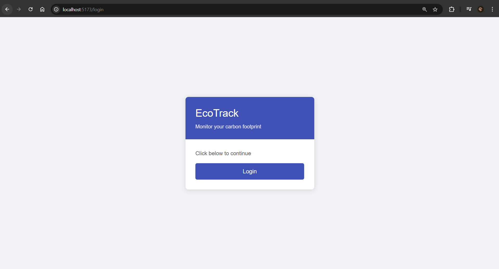
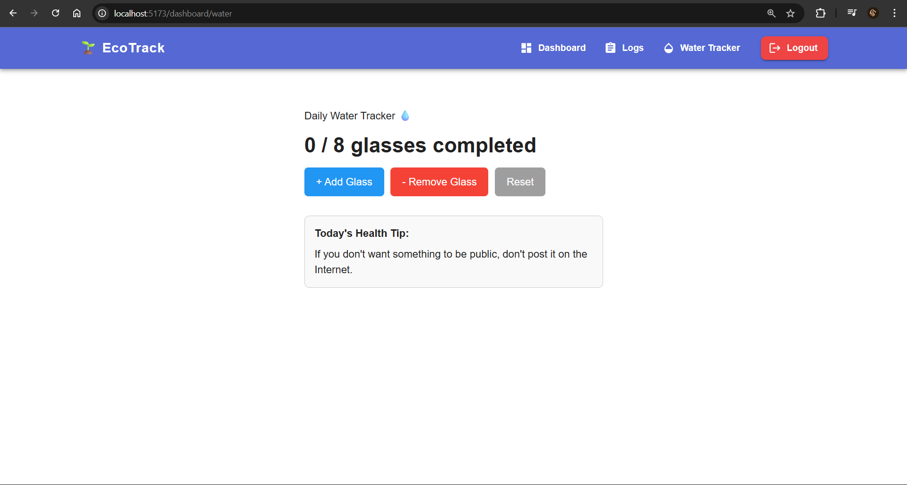
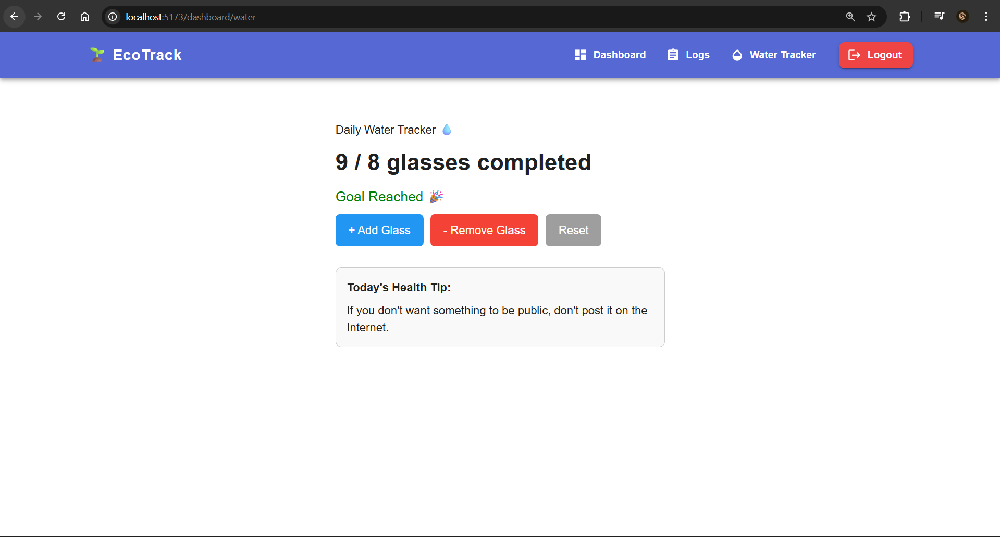

# EcoTrack - Daily Water Tracker Assignment

A React application built with Vite that includes user authentication and a Daily Water Tracker feature.

## Features

- Login / Logout with localStorage persistence
- Protected routes using React Router
- Daily Water Tracker with glass count, goal tracking, and health tips
- Performance optimization using `React.memo`, `useCallback`
- API integration with [Advice Slip API](https://api.adviceslip.com/)

## Tech Stack

- React 19
- React Router DOM
- Redux Toolkit + React Redux
- Material UI
- Tailwind CSS
- Vite

## How to Run

```bash
npm install
npm run dev
```

## Screenshots

### Login Page


### Water Intake Tracker


### Goal Reached

